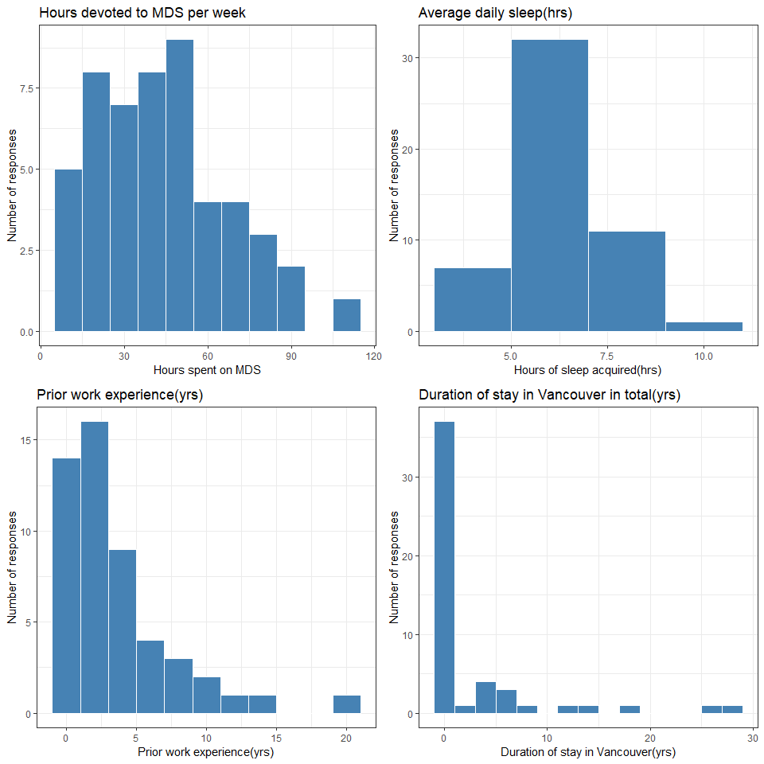
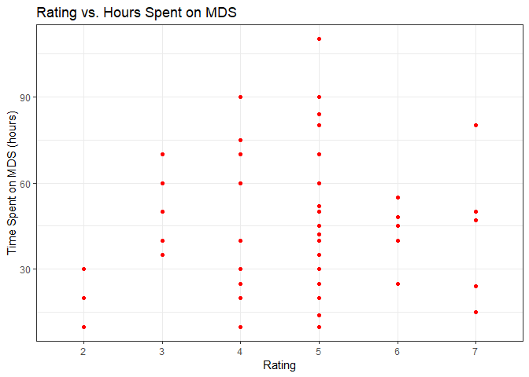
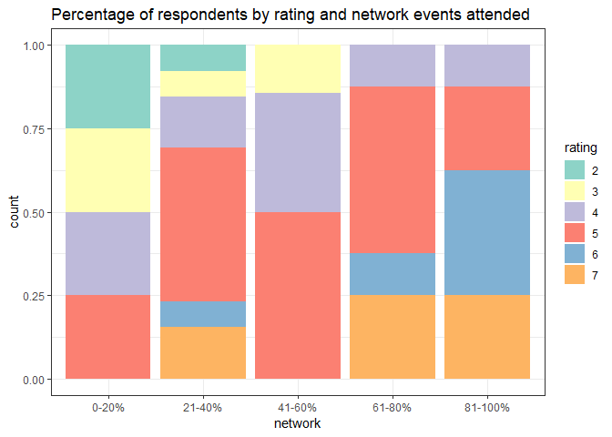

Commute Analysis
================
Aditya Sharma, Birinder Singh, Daniel Lin, Yenan Zhang
April 5, 2019

Analysis question
=================

Is a higher commute time associated with a lower self-rated experience of the MDS program?
------------------------------------------------------------------------------------------

The students were asked following 8 questions:

Question 1: On a scale of 1-7, to what extent could you utilize the resources MDS had to offer (office hours, information sessions, networking events, extra curriculars) 7 being you utilized every opportunity you wanted to.

Question 2: How many minutes does your commute take one-way?

Question 3: How many hours of sleep a night do you usually get?

Question 4: How many years of work experience do you have?

Question 5: Are you staying with family?

Question 6: How many years have you lived in the Vancouver area?

Question 7: How many hours per week do you spend on MDS coursework, including classes and labs?

Question 8: What percentage of networking events have you been able to attend?

We received 52 responses and the respondents were MDS students, Teaching Assistants and Instructors.

Below is the preliminary exploratory data analysis :

``` r
# Create suitable column headers
headers <- c('rating', 'commute_time', 'sleep', 'work_exp', 
             'family', 'vanc_stay', 'mds_hrs', 'network')

# Load the rest of the data
data <- read_csv('data/commute.csv')
```

    ## Parsed with column specification:
    ## cols(
    ##   `4` = col_double(),
    ##   `20` = col_double(),
    ##   `7` = col_double(),
    ##   `1` = col_double(),
    ##   No = col_character(),
    ##   `0` = col_double(),
    ##   `50` = col_double(),
    ##   `21-40%` = col_character()
    ## )

``` r
# Add the header names to the data
colnames(data) <- headers
```

``` r
# Checking the number of responses
dim(data)
```

    ## [1] 51  8

``` r
# Summary of different responses
summary(data)
```

    ##      rating       commute_time        sleep           work_exp     
    ##  Min.   :2.000   Min.   :  0.00   Min.   : 4.000   Min.   : 0.000  
    ##  1st Qu.:4.000   1st Qu.: 15.00   1st Qu.: 6.000   1st Qu.: 1.000  
    ##  Median :5.000   Median : 25.00   Median : 6.500   Median : 3.000  
    ##  Mean   :4.745   Mean   : 29.73   Mean   : 6.574   Mean   : 4.065  
    ##  3rd Qu.:5.000   3rd Qu.: 37.50   3rd Qu.: 7.000   3rd Qu.: 5.000  
    ##  Max.   :7.000   Max.   :120.00   Max.   :10.000   Max.   :20.000  
    ##     family            vanc_stay         mds_hrs         network         
    ##  Length:51          Min.   : 0.000   Min.   : 10.00   Length:51         
    ##  Class :character   1st Qu.: 0.000   1st Qu.: 27.50   Class :character  
    ##  Mode  :character   Median : 1.000   Median : 42.00   Mode  :character  
    ##                     Mean   : 3.323   Mean   : 45.22                     
    ##                     3rd Qu.: 3.500   3rd Qu.: 60.00                     
    ##                     Max.   :28.000   Max.   :110.00

``` r
# How the responses look like (displaying 5 responses)
head(data,5)
```

    ## # A tibble: 5 x 8
    ##   rating commute_time sleep work_exp family    vanc_stay mds_hrs network
    ##    <dbl>        <dbl> <dbl>    <dbl> <chr>         <dbl>   <dbl> <chr>  
    ## 1      5           60   6          7 No               27     110 21-40% 
    ## 2      2           30   8          5 No                0      20 0-20%  
    ## 3      5           20   5.5        1 Yes               5      50 41-60% 
    ## 4      4            6   8          0 Sometimes         0      40 41-60% 
    ## 5      4           25   7          2 Yes               1      20 0-20%

``` r
# Converting the Family and Number of networking events attended to Factor 
data <- data %>% 
  mutate(network = as.factor(network),
         family = as.factor(family),
          rating = as.factor(rating))

# Plot the number of networking events attended 
data %>% ggplot() +
  geom_bar(aes(network), color = 'white', fill = 'steelblue') +
  labs(title = 'Number of networking events attended' , 
       x = 'Percentage of Networking events',
       y = 'Number of respondents') +
  theme_bw()
```


``` r
# Plot the ratings to MDS by the students 
data %>% ggplot() +
  geom_bar(aes(rating), color='white', fill='steelblue') +
  labs(title = 'MDS experience rated by students', 
       x = 'MDS rating',
       y = 'Number of responses' ) +
  theme_bw()
```


``` r
# Plot the number of people staying with family
data %>% ggplot() +
  geom_bar(aes(family), color='white', fill='steelblue') +
  labs(title = 'People staying with family', 
       x = 'Responses to people staying with family',
       y = 'Number of responses' ) +
  theme_bw()
```


From the above EDA we notice that we have 52 responses to the 8 questions we asked.

``` r
# Plot the distribution of the responses for weekly hours spent on MDS, sleep time(hrs), prior work experience(yrs) and duration of stay in Vancouver prior to MDS (years)


plot_mds_hrs <- data %>% ggplot() +
  geom_histogram(aes(mds_hrs), binwidth = 10, color = 'white', fill = 'steelblue')+
  labs(title = 'Hours devoted to MDS per week', x = 'Hours spent on MDS',
       y = 'Number of responses') + theme_bw()

plot_sleep <- data %>% ggplot() +
  geom_histogram(aes(sleep), binwidth = 2, color = 'white', fill = 'steelblue') +
  labs(title = 'Average daily sleep(hrs)', x = 'Hours of sleep acquired(hrs)',
       y = 'Number of responses') + theme_bw()

plot_work_exp <- data %>% ggplot() +
  geom_histogram(aes(work_exp), binwidth = 2, color = 'white', fill = 'steelblue') +
  labs(title = 'Prior work experience(yrs)', x = 'Prior work experience(yrs)',
       y = 'Number of responses') + theme_bw()

plot_vanc_stay <- data %>% ggplot() +
  geom_histogram(aes(vanc_stay), binwidth = 2, color = 'white', fill = 'steelblue') +
  labs(title = 'Duration of stay in Vancouver in total(yrs)', x = 'Duration of stay in Vancouver(yrs)',
       y = 'Number of responses') + theme_bw()

grid.arrange(plot_mds_hrs, plot_sleep, plot_work_exp, plot_vanc_stay, ncol = 2, nrow = 2)
```



``` r
# Create categories for % of networking events attended from 1 to 5, 1 being attended hardly any event to 5 being attended almost all the events: 
# Example 0-20% = category 1 and 80-100% is category 5 

data <- data %>% 
  mutate(network = case_when(network == "0-20%"~1,
                   network == "21-40%"~2,
                   network == "41-60%"~3,
                   network == "61-80%"~4,
                   network == "81-100%"~5))
```

``` r
kable(data %>% 
    group_by(rating) %>% 
    summarise(commute_time = mean(commute_time)) %>% 
    arrange(rating), format = 'markdown')
```

| rating |  commute\_time|
|:-------|--------------:|
| 2      |       26.66667|
| 3      |       32.40000|
| 4      |       31.90909|
| 5      |       30.57143|
| 6      |       36.00000|
| 7      |       16.83333|

Clearly, people with less commute time have rated the experience very high!

``` r
kable(data %>% 
    group_by(rating) %>% 
    summarise(mds_hrs = mean(mds_hrs)) %>% 
    arrange(rating), format = 'markdown')
```

| rating |  mds\_hrs|
|:-------|---------:|
| 2      |  20.00000|
| 3      |  51.00000|
| 4      |  43.63636|
| 5      |  49.14286|
| 6      |  42.60000|
| 7      |  44.33333|

People who have rated the experience highest spend around 44 hours per week on an average on MDS coursework.

``` r
data %>% ggplot() +
  geom_point(aes(rating, mds_hrs), color = "red") +
  labs(title = 'Rating vs. Hours Spent on MDS',
       x = 'Rating',
       y = 'Time Spent on MDS (hours)') + theme_bw()
```



The above visualization plots the rating of usage of MDS resources against the time spent on MDS in a week. The motivation for looking at this plot is to see if students have to make a trade-off between one and the other. One the left side of the plot, we have a small group of three students that spend relatively fewer hours on labs and classes and don't use much of the MDS resources. For the students that used the MDS resources a moderate amount, there is a large spread in how many hours they spent on labs and classes. Since there are students use a moderate of resources that spend a lot of time on labs and classes, this suggests that there may not be a trade-off. Then the students that use MDS resources a lot appear to spend less time on labs and classes than those who use the resources moderate amount.

``` r
data %>% ggplot() +
    geom_point(aes(x = sleep, y = mds_hrs), color = "red") +
    labs(title = "Sleep time vs. Hours spent on coursework",
         x = "Average daily sleep time",
         y = "Hours per week spent on coursework") +
    theme_bw()
```


The above plot shows the relationship between hours spent on MDS coursework and the amount of sleep obtained per day on an average. We were expecting to see some negative correlation here. There is no strong correlation but the two-three outliers kind of follow the expected pattern. The logic behind this would be that if you are sleeping more, it means you might have more free time and you are able to complete MDS coursework in less amount of time.

``` r
data %>% ggplot() +
    geom_point(aes(x = family, y = mds_hrs), color = "red") +
    labs(title = "Staying with family vs. Hours spent on coursework",
         x = "Stay with family?",
         y = "Hours per week spent on MDS coursework") +
    theme_bw()
```


No specific pattern is observable in the above plot. People spend a varied number of hours on the coursework irrespective of whether they live with family or not.

``` r
data %>% ggplot() +
    geom_point(aes(x = commute_time, y = rating), color = "red")+
    labs(title = "Commute time vs. Rating",
         x = "Commute time (minutes)",
         y = "Rating for MDS") +
    theme_bw()
```


We think the above plot provides a good summary of our main question for the survey. As we expected, most of the people who have a high rating experience for the MDS program have low commute times. There is slight evidence of some people who travel a lot and have not rated the experience very high (maybe due to fatigue from the travel?).

``` r
data %>% ggplot() +
    geom_point(aes(x = work_exp, y = rating), color = "red")+
    labs(title = "Work experience vs. Rating",
         x = "Work experience (years)",
         y = "Rating for MDS") +
    theme_bw()
```


The relationship between `commute_time` and `rating` is very similar to the relationship between `work_exp` and `rating`. This suggests that there might be a positive correlation between `work_exp` and `commute_time`. Let's check that.

``` r
data %>% ggplot() +
    geom_point(aes(x = work_exp, y = commute_time), color = "red")+
    labs(title = "Work experience vs. Commute time",
         x = "Work experience (years)",
         y = "Commute time (minutes)") +
    theme_bw()
```


There is some positive correlation between these two variables but intuitively, it doesn't make much sense. One reason can be that people who have a lot of work experience have lived in Vancouver for a long time and their houses are far away from UBC. Most of the new graduates and less experienced people might have taken housing close to or on-campus because they might be new to Vancouver.

Remaking the above plot as addressed in the feedback.

``` r
data %>% 
    mutate(rating = as.factor(rating),
           network = case_when(network == 1~"0-20%",
                   network == 2~"21-40%",
                   network == 3~"41-60%",
                   network == 4~"61-80%",
                   network == 5~"81-100%")) %>% 
    group_by(rating, network) %>% 
    summarize(count = n()) %>% 
    ggplot() +
    geom_bar(aes(fill = rating, x = network, y = count), 
             position="fill", stat="identity") +
    scale_fill_brewer(palette = "Set3") +
    ggtitle("Percentage of respondents by rating and network events attended") +
    theme_bw()
```

 The above plot shows that most of the people who rated the experience high do attend most of the networking events. Most people attend 61-100% of these events and they rated the experience good (rating = 5,6,7)!
