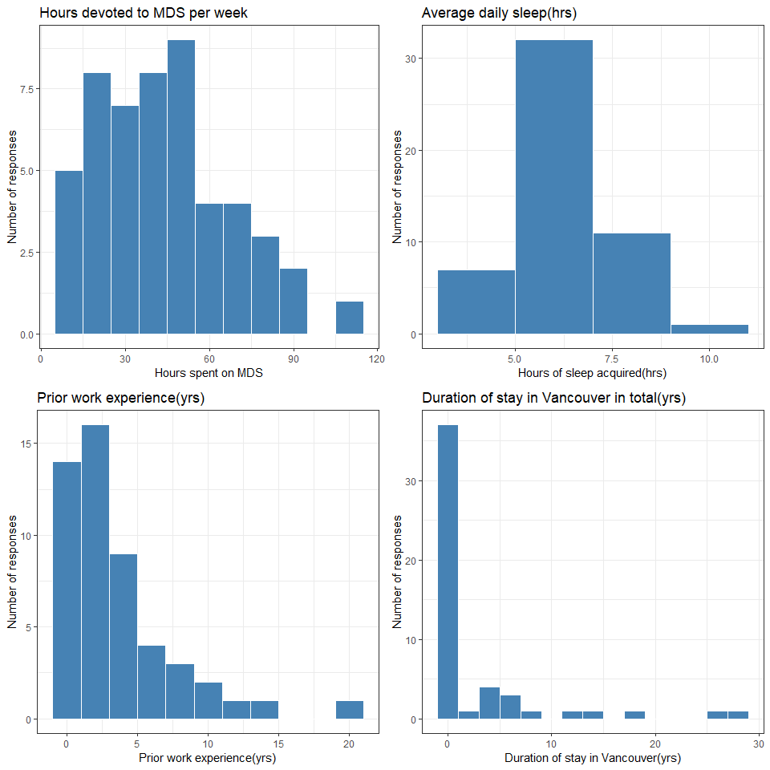
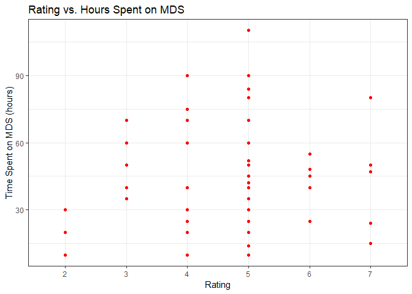
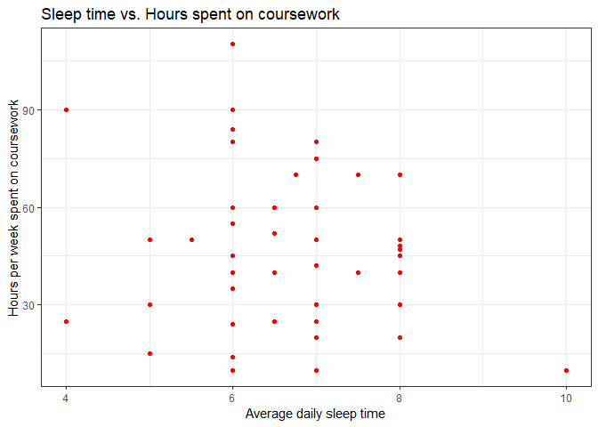
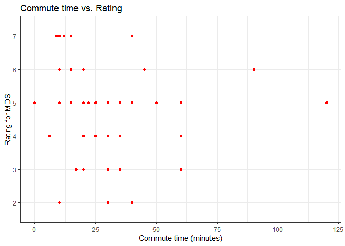
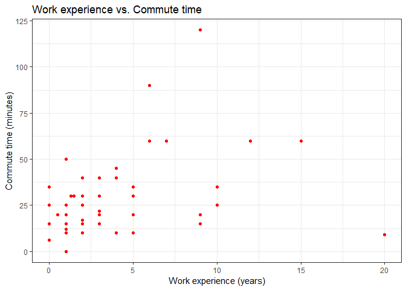
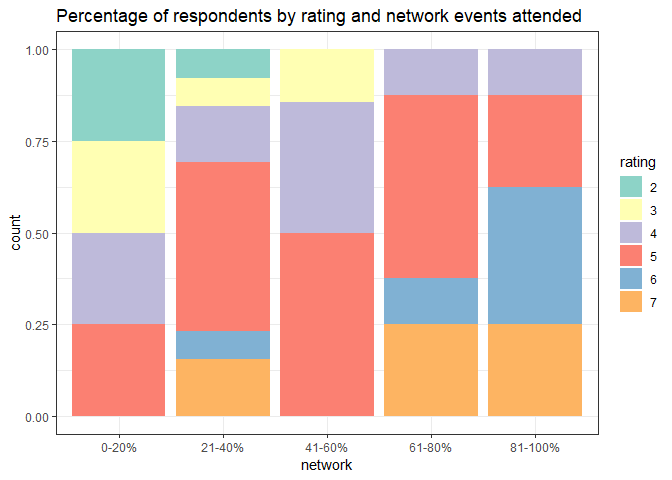
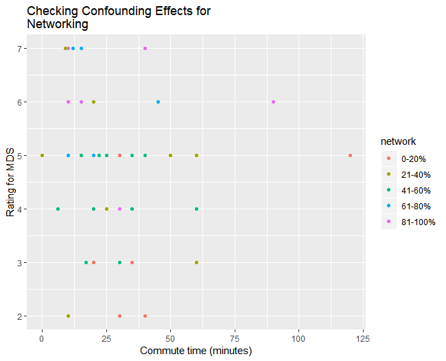
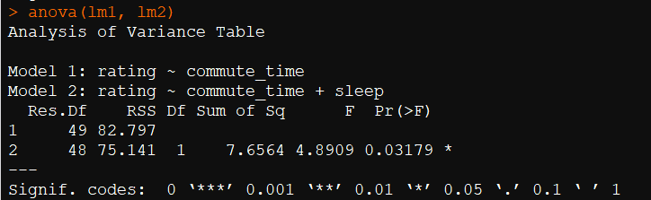
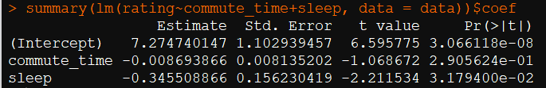
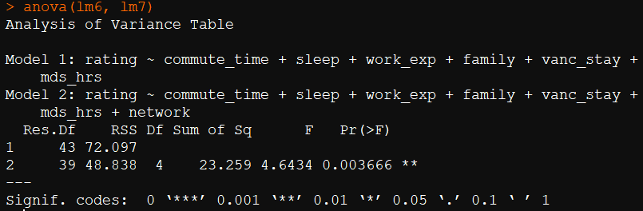

# Report

## Survey Question
In this study we were interested in the factors (specifically, the commute time) that influence a student's self-rated MDS experience.

Therefore, the question that we asked was:

**Is a higher commute time associated with a lower self-rated experience of the MDS program?**

## Initial Plan of Statistical Analysis

In this survey, we planned to test whether the average MDS enjoyment level for students living on and off-campus were different using hypothesis testing with linear regression.

Our null hypothesis was that there is no difference in the enjoyment level between the two groups, our alternative hypothesis was that the two group means are different. Tests were conducted at a 5% significance level.

Another part of our analysis was to summarize the survey results by looking at the ratings as categorical variables.

## Survey method

We used [UBC's Qualtrics Survey Tool](https://ubc.ca1.qualtrics.com) and the link to the completed survey is:

https://ubc.ca1.qualtrics.com/jfe/form/SV_dopfxNbvI7DxFJP

Here is the github link to the data we collected: https://github.ubc.ca/MDS-2018-19/commute-analysis/blob/readme_links/data/commute.csv

The students were asked the following 8 questions:

Question 1: On a scale of 1-7, to what extent could you utilize the resources MDS had to offer (office hours, information sessions, networking events, extra curriculars) 7 being you utilized every opportunity you wanted to.

Question 2: How many minutes does your commute take one-way?

Question 3: How many hours of sleep a night do you usually get?

Question 4: How many years of work experience do you have?

Question 5: Are you staying with family?

Question 6: How many years have you lived in the Vancouver area?

Question 7: How many hours per week do you spend on MDS coursework, including classes and labs?

Question 8: What percentage of networking events have you been able to attend?

The survey was conducted online anonymously during the lab session on April 3rd, 2019. We received 52 responses and the respondents were MDS students, Teaching Assistants and Instructors.

## Survey Study Design

We designed and tailored our survey to find an association between commute time and MDS experience. We made sure to think and brainstorm about the possible confounding variables and to include these variables in our data collection method. Since we designed and asked a question relevant to MDS students specifically, we expected most of our respondents to be from the current MDS cohort (2018-19). We ordered our questions in such a way so as to include the most important variables in the beginning of the survey in order to have responses to the most relevant questions as people might not fill the complete survey due to decision fatigue. Also, to avoid the missing values issue, we made most of the important questions mandatory.

**Note on data collection**: We have ensured that all the data is stored on a private GitHub server in Canada and that no personally identifiable information such as SIN number, Name, Student Number are collected. The data is accessible only by authorized personnel with secure authentication.

#### Confounding variables considered:

- **Hours of sleep**:  The amount of sleep a student gets may affect both the student's choice of living on or off-campus as well as their happiness with the MDS program. For example, someone that usually gets fewer hours may
have decided that they have more time for commuting. Also, the amount of sleep may affect their stress levels and how they feel about MDS.
- **Previous work experience**: The student's years of previous work experience may affect where they decide to live. One possibility is that a student with many years of work experience may not want to live on-campus with a bunch of undergrads. The years of work experience may also affect their satisfaction with MDS since their work experience may have prepared students for MDS.
- **Student commitment to MDS**: A student that spends lots of time on coursework may have decided to live on-campus to have more time for schoolwork. The type of student that is devoted to coursework may also get more from the program.
- **Staying with family**: Staying with family affects whether a student lives on or off-campus and also affects satisfaction with MDS since family could provide a support network.
- **Years spent in Vancouver**: Familiarity with the Vancouver area could help students be aware of off-campus housing. Being used to the area may also make handling the MDS program easier since those students don't have to adjust to living in a new area on top of dealing with the coursework.
- **attendance at networking events** If a student is really focused on finding a job, they may have chosen to live in an area with lots of companies. A student's focus on job searching could also affect their MDS satisfaction if they feel the program prepares them with the necessary skills.

## Some relevant EDA and findings

 

From the above EDA we notice that we have 52 responses to the 8 questions we asked. On the scale of 1-7, majority of the respondents rated their MDS experience a 5. Survey results show 6 out of 52 respondents rated MDS 7 and 3 respondents rated 2.   

  
From the above plots we notice that most of the respondents are devoting anywhere between 20-50 hours to MDS per week. Results indicate some students are devoting 60+ hours to MDS every week. On average the respondents are getting 6 hours of sleep daily. Most of the participants in the survey had less than 5 years of experience before joining MDS and the vast majority of students came to Vancouver probably for MDS as suggested by the concentration of stays less than 1 year.
  

  

The above visualization plots the rating of usage of MDS resources against the time spent on MDS in a week. The motivation for looking at this plot is to see if students have to make a trade-off between one and the other. One the left side of the plot, we have a small group of three students that spend relatively fewer hours on labs and classes and don't use much of the MDS resources. For the students that used the MDS resources a moderate amount, there is a large spread in how many hours they spent on labs and classes. Since there are students use a moderate of resources that spend a lot of time on labs and classes, this suggests that there may not be a trade-off. Then the students that use MDS resources a lot appear to spend less time on labs and classes than those who use the resources moderate amount.

  

The above plot shows the relationship between hours spent on MDS coursework and the amount of sleep obtained per day on an average. We were expecting to see some negative correlation here. There is no strong correlation but the two-three outliers kind of follow the expected pattern. The logic behind this would be that if you are sleeping more, it means you might have more free time and you are able to complete MDS coursework in less amount of time.

  

We think the above plot provides a good summary of our main question for the survey. As we expected, most of the people who have a high rating experience for the MDS program have low commute times. There is slight evidence of some people who travel a lot and have not rated the experience very high (maybe due to fatigue from the travel?).

  

There is some positive correlation between these two variables but intuitively, it doesn't make much sense. One reason can be that people who have a lot of work experience have lived in Vancouver for a long time and their houses are far away from UBC. Most of the new graduates and less experienced people might have taken housing close to or on-campus because they might be new to Vancouver.

**Redesigning the Heatmap based on feedback**

We are redesigning the heatmap according to the given feedback and making a stacked percentage barplot instead.

  

## Analysis method

Our approach was to first carry out linear regression between the response variable `rating` and the predictor `commute_time` to find if any association exists between them. The next step was to include the confounding variables and see if the inclusion of any of them is significant and how it affects the relationship between response and the predictor. The confounding variables that intuitively made sense were `sleep` and `network` events MDS students could attend which we believe could be associated with the rating and also to the commute time to the university.

In order to be sure and obtain consistent results for feature selection, we decided to obtain feature importance using Random Forests as well.

During our analysis, the dependent variable, self-rated MDS experience (`rating`), was chosen as a continuous variable. First, a base linear regression model was built using only the dependent (`rating`) and the independent variable (`commute_time`). One by one, confounding variables were added to the regression model and the models were compared to subsequent models using the ANOVA test. This was, in a way, a forward selection method for feature selection.

Here is the GitHub link to the data we collected:

| Links  |
| :------------- |
| [Data collected](https://github.ubc.ca/MDS-2018-19/commute-analysis/blob/readme_links/data/commute.csv)     |
| [Statistical analysis](https://github.ubc.ca/MDS-2018-19/commute-analysis/blob/master/statistical_analysis.R)   |
| [Initial EDA](https://github.ubc.ca/MDS-2018-19/commute-analysis/blob/master/Commute_Analysis.md) |

### Checking confounding effect of the network variable

  

The above plot was made to analyze the confounding effect of the network variable on the dependent and the independent variable. We can see a decent pattern here that with an increase in the attendance to the networking events, the self-rated experience is also increasing. So there seems to be a confounding effect of the `network` variable. We can test this further with our regression analysis.

## Analysis Results

When we created a regression between the response variable `rating` and the predictor `commute_time` we found that `commute_time` was insignificant at 5% significance level. We decided to include `sleep` as a confounding variable based on our intuitions. The ANOVA test between the simple model and the model with `sleep` as a predictor was significant at a 5% significance level (Figure 1).

Figure 1. *ANOVA test for Model 1 without weekly hours of sleep covariate and Model 2 with weekly hours of sleep covariate*

The linear regression with confounding effect of `sleep` still indicated no association between the `commute_time` and `rating` as the p value was still less than 5%.

Besides `sleep` the importance of each predictor from the random forest is given in the following table:

| Predictor | Importance |
| -- | -- |
| Commute Time |    12.7 |
| Sleep         |    9.9 |
| Work Experience    |     10.5 |
| Family      |      2.2 |
| Years in Vancouver |         6.2 |
| Hours Spent on MDS per Week |          10.7 |
| Networking Events  |        17.6 |

From these results, we got the top five features, commute time, sleep, work experience, hours spent on MDS per week, and networking events. We added variables one-by-one, conducting an ANOVA test after adding each variable.  We had already tested `sleep` now we added work experience, years lived in Vancouver, hours spent on MDS a week, and then networking events attended, in that order.  The ANOVA tests showed that weekly hours of sleep and networking events attended were the only significant additions as shown in the ANOVA results in Figure 1 and Figure 2 :   

Figure 2. *ANOVA test for Model 1 without network covariate and Model 2 with network covariate*

The model with `sleep` and `network` as confounding variables have following p-values:

| Variable | Coefficient | p-Value |
| -- | -- | -- |
| Commute Time | -0.001 | 0.85 |
| Sleep | -0.26 | 0.067 |
| Networking 21-40% | 1.33 | 0.01 |
| Networking 41-60% | 0.78 | 0.11 |
| Networking 61-80% | 1.9 | 0.0015|
| Networking 81-100% | 2.08 | 0.00056|

Above analysis could not establish any association between the self rated MDS `rating` and the `commute time`. Even after the inclusion of the most significant confounding variables the coefficient of commute time is still not significant at 5% significance level.

Helpful resource on confounding effects : http://www.medicine.mcgill.ca/epidemiology/joseph/courses/epib-621/confounding.pdf

## What We Did to Isolate the Association between Commute Time and Satisfaction

One thing we did to isolate the association between the independent variable we were interested in, commute time, and the dependent variable, satisfaction, was to address as many confounding variables as we could think of.  

## What was not Done Well

We could not get a very representative sample.  For example, there were not many respondents who stayed with family.  Since our sample was small, we could not stratify the sample into homogeneous blocks to handle confounding variable. For instance, if we could get the respondents having same sleeping hours but different commute time then their response would indicate if commute time led to different rating of MDS.

## What would We do Differently

We would be more careful about using more specific language in our research question.  Initially, our question was just focused on whether living on-campus was associated with higher satisfaction which we later modified to the commute time.  Another thing we could do differently is to look at not just MDS students, but also computer science students as this would give us more respondents and probably more stratification.  Also, we could try a different survey platform.  A more engaging platform might help us get a better survey response rate.
